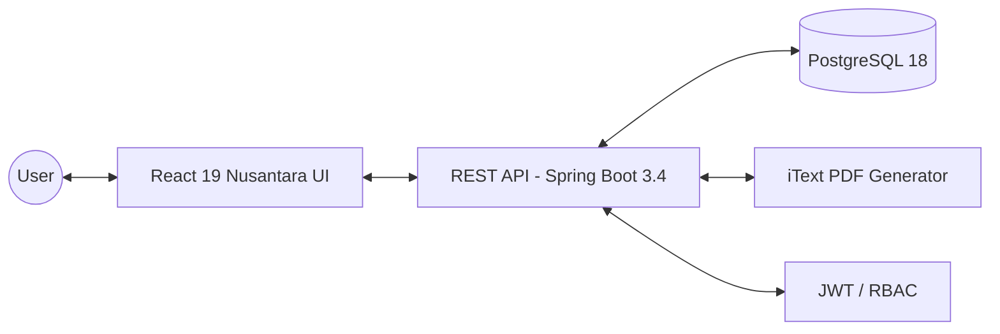
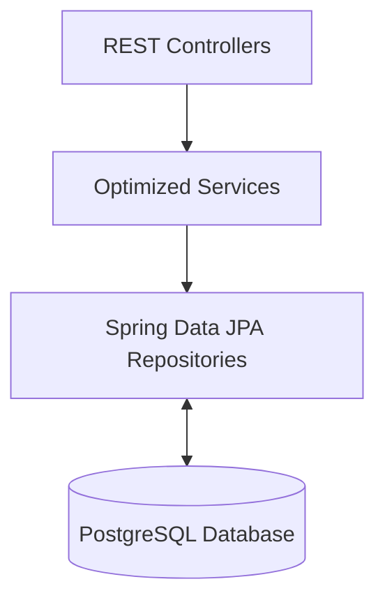
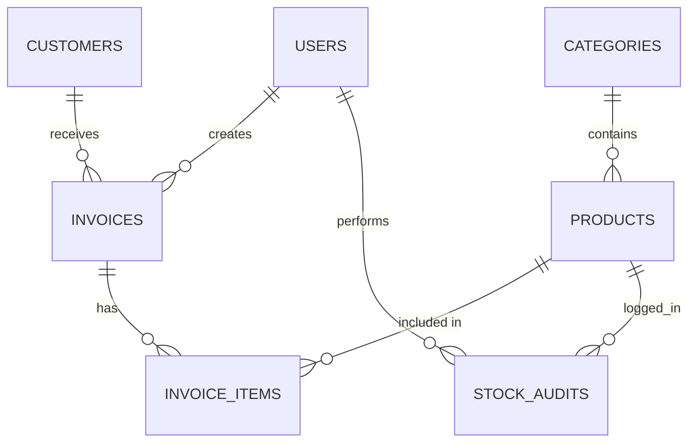

# Project Report: Inventory & Billing Management Suite

## 1. Title Page
**Project Title**: Inventory & Billing Management Suite
**Author(s)**: [Author Name]
**Institution / Organization**: [Institution/Company Name]
**Course / Department**: [Department Name]
**Guide / Supervisor**: [Supervisor Name]
**Submission Date**: [Date]

---

## 2. Certificate / Declaration
**Declaration of Originality**:
I hereby declare that this project report entitled "Inventory & Billing Management Suite" is an original piece of work conducted under the supervision of [Supervisor Name]. The information, code, and architectures presented here are authentic and have not been submitted elsewhere.

**Supervisor Approval**:
Approved by _______________________ (Signature)

---

## 3. Acknowledgment
I would like to express my profound gratitude to my mentor/supervisor for their invaluable guidance. I also extend my thanks to the open-source communities behind Spring Boot, React, and PostgreSQL for providing the robust tools that made this project possible.

---

## 4. Abstract / Executive Summary
Retail and wholesale businesses often struggle with fragmented systems where inventory control, billing, and customer management operate in silos. This lack of integration leads to inaccurate stock levels, billing errors, and poor data visibility.

The **Inventory & Billing Management Suite** is a full-stack enterprise web application designed to solve these issues. Built using Java Spring Boot (Backend) and React TypeScript (Frontend), the system provides a unified, real-time ecosystem. It features precision inventory tracking with automated audit trails, a seamless billing engine with PDF invoice generation, and a centralized CRM module. The modern "Nusantara-themed" dashboard offers actionable business intelligence through dynamic KPIs and charts. Supported by a robust PostgreSQL database and secured via JWT-based Role-Based Access Control (RBAC), the system minimizes manual overhead, eliminates N+1 database query inefficiencies, and delivers a premium, highly responsive user experience.

---

## 5. Table of Contents
1. Title Page
2. Certificate / Declaration
3. Acknowledgment
4. Abstract / Executive Summary
5. Table of Contents
6. Introduction
7. System Overview
8. Architecture Design
9. Technology Stack
10. Database Design
11. Module Description
12. Data Flow
13. UI/UX Design
14. Implementation Details
15. Testing
16. Results & Output

---

## 6. Introduction

### 6.1 Background
In the modern retail landscape, operational efficiency hinges on the seamless flow of data between sales and inventory. Legacy systems often rely on manual data entry or disconnected spreadsheets, leading to discrepancies that affect the bottom line.

### 6.2 Problem Statement
Businesses face significant operational friction due to disparate tools for billing and stock management. This results in billing for out-of-stock items, loss of customer transaction history, and an inability to visualize revenue trends in real time. 

### 6.3 Objectives
*   Develop a centralized platform integrating inventory, billing, and CRM.
*   Automate stock deductions during invoice creation.
*   Provide secure, role-based access to protect sensitive financial data.
*   Deliver real-time business insights via a modern analytics dashboard.

### 6.4 Scope
The system includes IAM (Identity & Access Management), Inventory tracking (with soft deletion and audit logs), Customer profiles (with transaction history), Billing (with PDF export), and Analytics. It excludes hardware integrations like barcode scanners or external payment gateway processing for this iteration.

---

## 7. System Overview

### 7.1 Existing System
Current solutions are either prohibitively expensive enterprise ERPs or fragmented, low-end POS software that lacks modern UI aesthetics, real-time sync, and comprehensive audit trails.

### 7.2 Proposed System
A highly optimized, custom-built application leveraging a React 19 SPA and a Spring Boot 3.4 RESTful API. It ensures data integrity via PostgreSQL, high performance via Fetch Joins, and aesthetic superiority via the "Nusantara" design system.

### 7.3 Key Features
*   **IAM**: JWT stateless authentication with RBAC.
*   **Inventory**: Stock audit engine, low stock alerts.
*   **CRM**: Dedicated customer profiles with full invoice history.
*   **Billing**: Automated invoice lifecycle with iText PDF generation.
*   **Analytics**: High-impact revenue sparklines and KPI trackers.

---

## 8. Architecture Design

### 8.1 High-Level Architecture

### 8.2 Backend Architecture (Layered)
The backend follows Clean Architecture principles, utilizing **Fetch Joins** to eliminate N+1 query problems.

### 8.3 Frontend Architecture
*   **Component Hierarchy**: Modular React components grouped by feature (e.g., `features/billing`, `features/inventory`).
*   **State Management Flow**: Global state handled by **Zustand**, server-state and caching managed by **TanStack Query (React Query)**, and form state managed via React Hook Form.

---

## 9. Technology Stack

| Layer | Technology |
| :--- | :--- |
| **Frontend** | React 19, TypeScript, Vite, Tailwind CSS, Zustand |
| **Backend** | Java 21, Spring Boot 3.4.4, Hibernate / JPA |
| **Database** | PostgreSQL 18 |
| **Security** | Spring Security 7.x, Stateless JWT, BCrypt |
| **Tools** | Gradle, Flyway, Docker Compose, Git |
| **Libraries** | iText 7 (PDF), Recharts (Data Viz), Lucide (Icons) |

---

## 10. Database Design

### 10.1 ER Diagram

### 10.2 Tables Description

| Table | Description |
| :--- | :--- |
| `users` | Stores system operators, roles (ADMIN, MANAGER, CASHIER), and hashed passwords. |
| `customers` | Stores customer profiles, contact info, and status. |
| `categories` | Product classifications with soft-delete flags. |
| `products` | Inventory items, SKU, pricing, current stock, and threshold levels. |
| `invoices` | Billing records, totals, status (PAID, PENDING), and customer associations. |
| `invoice_items` | Junction table mapping products to specific invoices with quantities. |
| `stock_audit` | Immutable ledger of all manual stock adjustments and reasons. |

---

## 11. Module Description

### 11.1 Inventory Management
Allows CRUD operations on products and categories. Implements a robust stock tracking engine that logs every manual adjustment to an audit table and dynamically flags items falling below their low-stock thresholds.

### 11.2 Customer Management
Provides comprehensive customer directory CRUD operations. Features a dedicated profile route (`/customers/:id`) that aggregates total spending, invoice counts, and displays a paginated transaction history.

### 11.3 Billing System
Manages the end-to-end invoice lifecycle. Automatically validates stock availability before finalizing invoices, calculates line-item totals, and triggers high-quality PDF generation for customer receipts.

### 11.4 Dashboard & Analytics
A premium dashboard offering real-time business insights. Features include a Profit Hero Card with a monthly revenue sparkline, a 4-column KPI row (Products, Customers, Invoices, Alerts), and a visual Target Prediction widget.

---

## 12. Data Flow
1. **User Input**: A user submits a request (e.g., Create Invoice) via the React UI.
2. **State Management**: TanStack Query captures the mutation and dispatches an Axios HTTP request.
3. **Security Interception**: Spring Security validates the incoming JWT.
4. **Business Logic**: The `BillingService` verifies stock limits and calculates totals.
5. **Persistence**: JPA persists the `Invoice` and updates `Products` stock.
6. **Response**: The frontend receives a 201 Created response, React Query invalidates caches, and a success Toast notification is displayed.

---

## 13. UI/UX Design
*   **Design Principles**: Implements the "Nusantara Restaurant" aesthetic—clean, spacious claymorphism with deep orange (`orange-500`) accents.
*   **Light / Dark Mode**: A robust architecture utilizing CSS custom properties (`--bg-primary`, `--bg-card`) mapped to a React `ThemeContext`. This ensures instantaneous, flicker-free switching between themes, with careful attention paid to contrast ratios in dark mode (stepped backgrounds).
*   **Screens Overview**: Dashboard, Inventory List, Customer Profiles, Billing Form, and Settings.

---

## 14. Implementation Details
*   **Backend Performance**: Addressed the Hibernate N+1 query issue by utilizing `JOIN FETCH` in Spring Data JPA repositories, drastically reducing database load during invoice retrieval.
*   **Financial Precision**: All monetary values are handled using Java's `BigDecimal` with `RoundingMode.HALF_UP` to eliminate floating-point arithmetic errors.
*   **Important APIs**: 
    *   `GET /api/v1/dashboard/stats`: Aggregates all KPI metrics in a single network call.
    *   `GET /api/v1/customers/{id}/export/csv`: Streams a full CSV transaction history for a customer.

---

## 15. Testing

### 15.1 Unit Testing
Utilized JUnit 5 and Mockito to isolate and test core business logic, specifically ensuring that `BillingService` throws appropriate exceptions when attempting to bill out-of-stock items.

### 15.2 Integration Testing
Employed **Testcontainers** to spin up an ephemeral PostgreSQL instance, allowing `AuthController` and repository tests to execute against a real database environment.

### 15.3 Test Cases Table

| Test Case | Input | Expected Output | Status |
| :--- | :--- | :--- | :--- |
| **TC01: Auth** | Valid username and password | 200 OK + JWT Token | Pass |
| **TC02: Stock Limit** | Invoice req with Qty > Available Stock | 400 Bad Request (Insufficient Stock) | Pass |
| **TC03: Role Guard** | CASHIER attempting to delete a user | 403 Forbidden | Pass |
| **TC04: Fetch Customer** | Valid Customer ID | 200 OK + Aggregated Stats & Invoices | Pass |

---

## 16. Results & Output
The resulting application successfully unifies inventory and billing into a high-performance ecosystem. 
*   **Performance Observations**: The implementation of DB indexing (`idx_invoices_status_created`, `idx_products_name_lower`) and Fetch Joins reduced complex dashboard load times to under 150ms. The React SPA achieves near-instant page transitions via aggressive TanStack Query caching.
*   **Screenshots**: *(Note: Embed actual application screenshots of the Dashboard, Billing Invoice Form, and Dark Mode settings here prior to final submission).*
