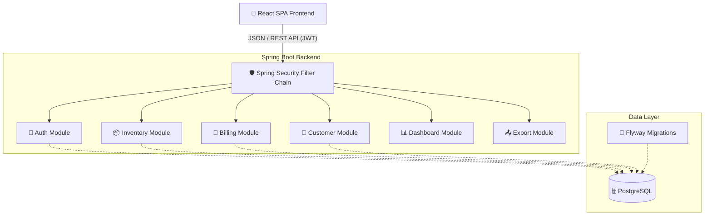

<div align="center">

# 📦 Inventory & Billing Management System

[](https://openjdk.java.net/)
[](https://spring.io/projects/spring-boot)
[](https://www.postgresql.org/)
[](https://reactjs.org/)
[](https://www.typescriptlang.org/) 
[](https://tailwindcss.com/)

A modern, high-performance enterprise application for managing inventory, tracking stock levels, handling customers, and generating professional PDF invoices.

[Features](#features) • [Architecture](#architecture) • [Tech Stack](#tech-stack) • [Getting Started](#getting-started) • [Production Readiness](#production-readiness) • [API Docs](#api-documentation)

</div>

---

## ✨ Features

🔐 **Role-Based Access Control (RBAC)**
* Secure JWT authentication with automated refresh flow.
* Distinct roles: **ADMIN**, **MANAGER**, and **CASHIER** with fine-grained UI and API guards.

📊 **Interactive Dashboard & Analytics**
* Real-time revenue charts (last 6 months) using Recharts.
* Key performance metrics: Total Revenue, Pending Invoices, Low Stock Alerts, and Customer count.
* Critical stock replenishment table with visual status badges.

📦 **Intelligent Inventory Management**
* Hierarchical product categorization.
* Real-time stock tracking with automated deduction upon invoice creation.
* Full stock adjustment auditing with detailed reason tracking.
* **Export to CSV** for products and categories (Admin/Manager only).

👥 **Customer Directory**
* Comprehensive customer profiles with address and contact details.
* Deep search across names, emails, and phone numbers.
* **Export to CSV** for customer lists.

🧾 **Advanced Billing & Invoicing Engine**
* Dynamic line-item additions with real-time subtotal, tax, and discount calculations.
* Complex invoice lifecycle: `DRAFT` ➔ `ISSUED` ➔ `PAID` (or `CANCELLED`).
* **Professional PDF Generation:** Download beautiful, system-generated PDF invoices for clients.
* **Export to CSV** with status and date filters.

---

## 🏗️ Architecture

The system follows a decoupled architecture, utilizing a RESTful Spring Boot 3.4 backend serving a responsive React 19 SPA.



---

## 🚀 Getting Started

### Prerequisites
- **Java 21** (OpenJDK)
- **Node.js** (v20+) and npm
- **Docker & Docker Compose**

### 🛠️ Development Setup

1. **Start the Database:**
   ```bash
   docker-compose up -d postgres
   ```

2. **Run the Backend:**
   ```bash
   ./gradlew bootRun
   ```
   *Backend: http://localhost:9090/api/v1*

3. **Run the Frontend:**
   ```bash
   cd inventory-frontend
   npm install
   npm run dev
   ```
   *Frontend: http://localhost:5173*

---

## 🏗️ Production Readiness

### 🛡️ Required Environment Variables
Never hardcode secrets. Ensure these are set in your production environment:

| Variable | Description |
| :--- | :--- |
| `SPRING_PROFILES_ACTIVE` | Set to `prod` to enable production configurations. |
| `DB_HOST` / `DB_PORT` | PostgreSQL host and port. |
| `DB_NAME` / `DB_USER` / `DB_PASSWORD` | Database credentials. |
| `JWT_SECRET` | A secure, random Base64 string (64+ chars). |
| `VITE_API_BASE_URL` | Frontend env var pointing to the production API URL. |

### 🔒 Security Best Practices
- **Generate a JWT Secret:** Use `openssl rand -base64 64` to create your `JWT_SECRET`.
- **Change Default Password:** Log in as `admin@inventory.com` / `Admin@1234` and update the password immediately.
- **Database Backups:** Schedule nightly backups using `pg_dump`:
  ```bash
  pg_dump -U postgres inventory_db > backup_$(date +%Y%m%d).sql
  ```

### 📦 Deployment (Docker)
Build and start the entire stack using the multi-stage Docker setup:
```bash
docker-compose build
docker-compose up -d
```

---

## 📚 API Documentation

Once the backend is running (in `local` profile), visit:
👉 **[http://localhost:9090/api/v1/swagger-ui/index.html](http://localhost:9090/api/v1/swagger-ui/index.html)**

*(Note: Swagger UI is disabled in the `prod` profile for security).*

---

<div align="center">
  <p>Built for high-performance inventory and billing management. 🚀</p>
</div>
