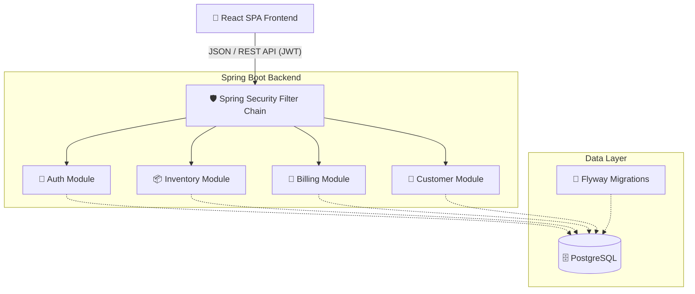
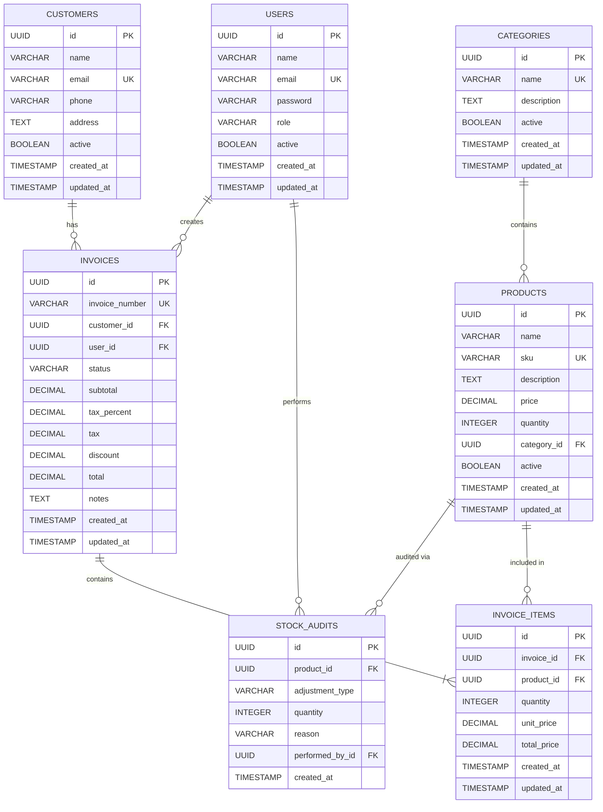

<div align="center">

# 📦 Inventory & Billing Management System

[](https://openjdk.java.net/)
[](https://spring.io/projects/spring-boot)
[](https://www.postgresql.org/)
[](https://reactjs.org/)
[](https://www.typescriptlang.org/)****
[](https://tailwindcss.com/)

A modern, full-stack enterprise application for managing inventory, tracking stock levels, handling customers, and generating professional invoices.

[Features](#features) • [Architecture](#architecture) • [Tech Stack](#tech-stack) • [Getting Started](#getting-started) • [API Docs](#api-documentation)

</div>

---

## ✨ Features

🔐 **Role-Based Access Control (RBAC)**
* Secure JWT authentication.
* Distinct roles: **ADMIN**, **MANAGER**, and **CASHIER** with fine-grained UI and API guards.

📦 **Intelligent Inventory Management**
* Hierarchical product categorization.
* Real-time stock tracking with automated deduction upon invoice creation.
* Configurable "Low Stock" alerts and automated thresholds.
* Full stock adjustment auditing (tracking manual additions/deductions).

👥 **Customer Directory**
* Comprehensive customer profiles with address and contact details.
* Deep search across names, emails, and phone numbers.
* Centralized view of individual customer invoice history.

🧾 **Advanced Billing & Invoicing Engine**
* Dynamic line-item additions with real-time subtotal, tax, and discount calculations.
* Complex invoice lifecycle state machine: `DRAFT` ➔ `ISSUED` ➔ `PAID` (or `CANCELLED`).
* Automated stock restoration if an invoice is cancelled.

---

## 🏗️ Architecture

The system follows a modern decoupled architecture, utilizing a RESTful Spring Boot backend serving a responsive React Single Page Application (SPA).



---

## 🗄️ Database Schema

The core relational data model is managed via PostgreSQL and tracks users, customers, inventory, and complete invoice lifecycles.



---

## 🛠️ Tech Stack

### **Backend**
- **Core:** Java 21, Spring Boot 3.3.x
- **Security:** Spring Security, JWT (JSON Web Tokens)
- **Data:** Spring Data JPA, Hibernate, PostgreSQL
- **Migrations:** Flyway
- **API Docs:** SpringDoc OpenAPI (Swagger UI)
- **Build Tool:** Gradle (Groovy)

### **Frontend**
- **Core:** React 18, TypeScript, Vite
- **State Management:** Zustand (Client Auth), TanStack React Query v5 (Server State)
- **Routing:** React Router v6
- **Styling:** Tailwind CSS, `clsx`, `tailwind-merge`
- **Forms & Validation:** React Hook Form, Zod
- **Icons:** Lucide React

---

## 🚀 Getting Started

### Prerequisites
- **Java 21** installed.
- **Node.js** (v18+) and npm.
- **Docker & Docker Compose** (for running the database easily).

### 1. Start the Database (Docker)
The easiest way to run PostgreSQL is via the included `docker-compose.yml` file.
```bash
docker-compose up -d postgres
```
*Note: This spins up a PostgreSQL 15 instance on port `5432` with user `postgres` and password `toor`.*

### 2. Start the Backend (Spring Boot)
The backend uses Flyway to automatically create the database schema on startup.
```bash
# On Windows
./gradlew.bat bootRun

# On Mac/Linux
./gradlew bootRun
```
*The backend runs on **http://localhost:9090** (configurable in `application.yml`).*

### 3. Start the Frontend (React)
Open a new terminal window and navigate to the frontend directory:
```bash
cd inventory-frontend
npm install
npm run dev
```
*The frontend runs on **http://localhost:5173**.*

---

## 🔑 Default Credentials

Upon running the application, you can use the default Admin account to log in:

- **Email:** `admin@inventory.com`
- **Password:** `Admin@1234`

*(Additional test accounts can be registered via the Auth API if needed).*

---

## 📚 API Documentation

The backend exposes a fully interactive Swagger UI for testing endpoints and reviewing the OpenAPI specification.

Once the backend is running, visit:
👉 **[http://localhost:9090/api/v1/swagger-ui/index.html](http://localhost:9090/api/v1/swagger-ui/index.html)**

---

## 📁 Project Structure

```text
inventory-billing-system/
├── src/main/java/.../app/      # Spring Boot Backend Source
│   ├── common/                 # Global exceptions, responses, configs
│   ├── module/                 # Domain-driven modules (auth, billing, customer, inventory)
│   └── security/               # JWT filters and auth providers
├── src/main/resources/         # Backend Configs & Flyway Migrations
│   └── db/migration/           # V1 to V10 SQL schema files
├── inventory-frontend/         # React SPA
│   ├── src/
│   │   ├── api/                # Axios instance & API endpoints
│   │   ├── components/         # Reusable UI (DataTables, Modals, Layout)
│   │   ├── hooks/              # React Query custom hooks
│   │   ├── pages/              # Full-screen route components
│   │   ├── store/              # Zustand global state (Auth)
│   │   └── types/              # TypeScript interfaces (DTOs)
│   └── vite.config.ts          # Vite & Proxy configuration
├── docker-compose.yml          # Local database orchestration
└── build.gradle                # Backend dependencies
```

---

<div align="center">
  <p>Built with ❤️ for efficient inventory and billing management.</p>
</div>
